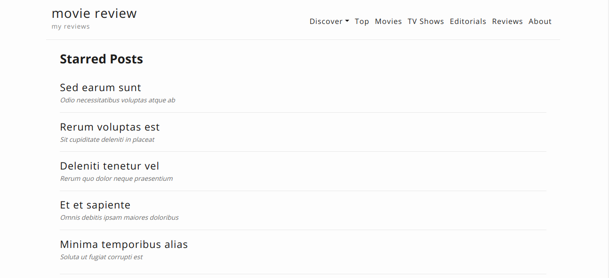

# movie-theme

movie-theme is a minimal and clean entertainment/review theme for [Hugo](http://gohugo.io/). 

### [Demo](https://movietheme.muthukrishnan.dev/)

Working demo is available [here](https://movietheme.muthukrishnan.dev/).

### Screenshot



### Installation

#### Using git sub-modules
```
git submodule add https://github.com/muthukrishnandev/movie-theme themes/movie-theme
cp themes/movie-theme/config.toml .
```

refer [hugo docs](http://gohugo.io/themes/installing) for more information.

### Build your site

```
hugo server -t movie-theme
```

### Configuration

For full configuration of theme refer [config/_default](https://github.com/muthukrishnandev/movie-theme/blob/master/exampleSite/config/_default) directory

### Attribution

##### Frameworks & Libraries
- [Bootstrap 4](https://getbootstrap.com/)
- [jQuery](https://jquery.com/)
- [YouTube Lite](https://www.labnol.org/internet/light-youtube-embeds/27941/) by Amit Agarwal

##### Inspirations
- [Hugo Pagination](https://github.com/gohugoio/hugo/blob/master/tpl/tplimpl/embedded/templates/pagination.html)
- [PriceTag CSS](https://codepen.io/wbeeftink/pen/dIaDH)
- [Movie Card](https://codepen.io/simoberny/pen/qxxOqj)

##### Icons
- [Picons Social](https://www.iconfinder.com/iconsets/picons-social) by Picons.me
- [Free Social Icons](https://www.iconfinder.com/iconsets/free-social-icons) by Neil Hainsworth
- [MiU Flat Social](https://www.iconfinder.com/iconsets/miu-flat-social) by Xinh Studio
- [Social Media](https://www.iconfinder.com/iconsets/social-media-2285) by Iconfinder

### License

This theme is open sourced under [MIT license](https://github.com/muthukrishnandev/movie-theme/blob/master/LICENSE.md).
